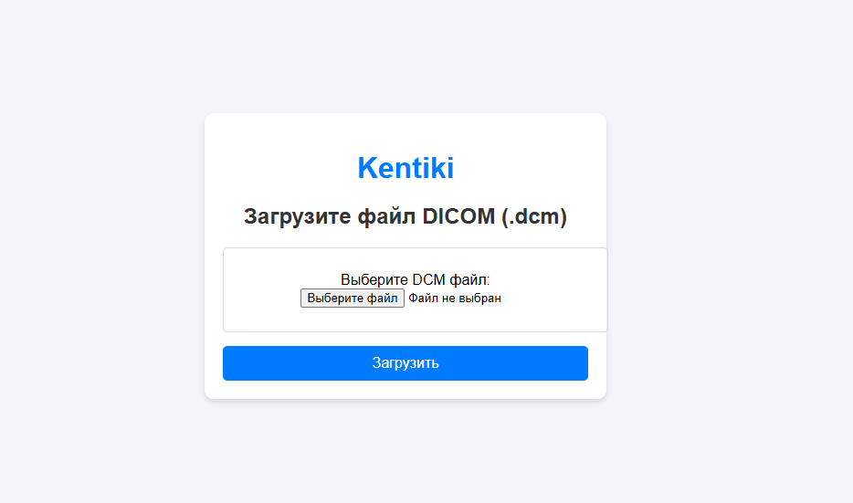
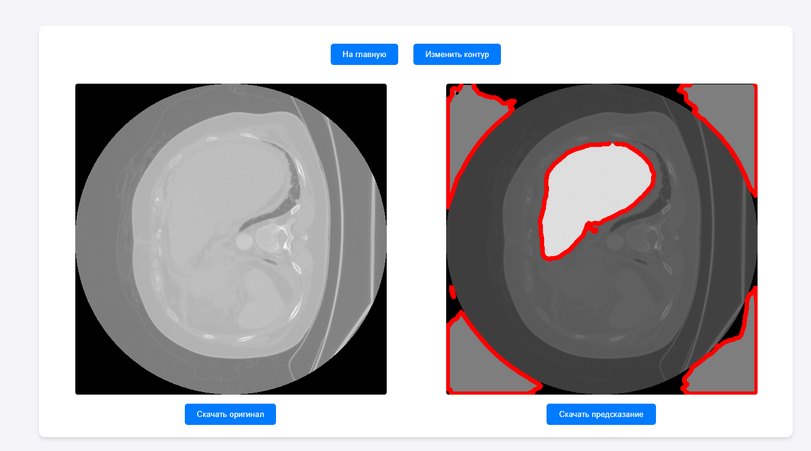
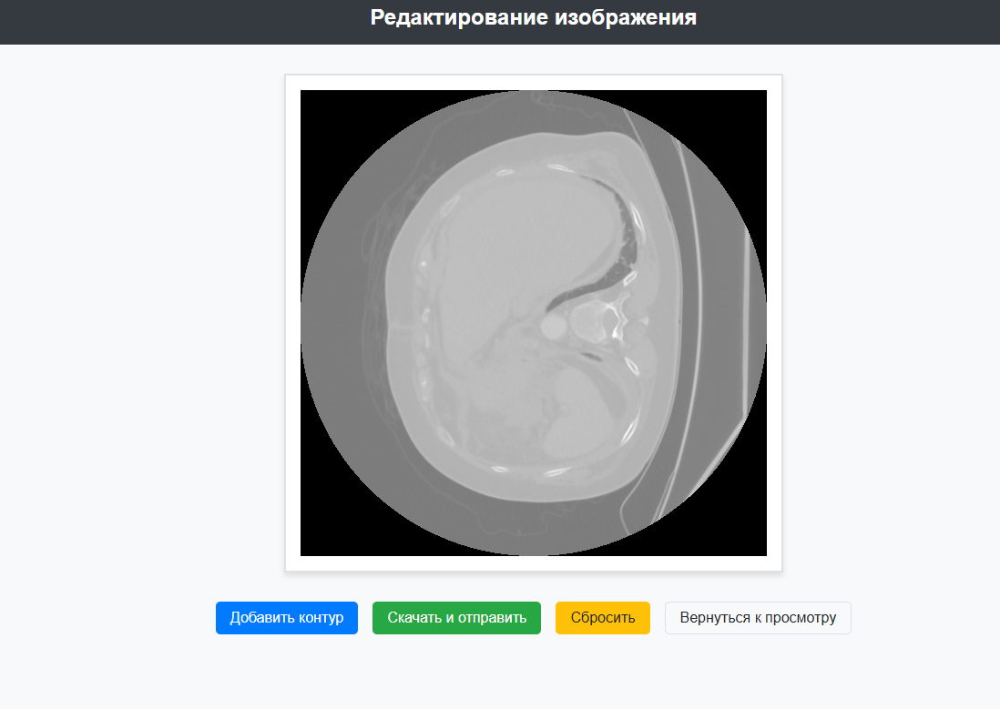

# Ссылка на сервис 
- [МЛ-сервис](http://89.169.147.161:8000/)

# Ссылка на докер хаб 
- [Докер хаб](https://hub.docker.com/repository/docker/ttiimmiiuuss/ml_service_kt/tags)

# Скрины сервиса

# Сегментация печени на изображениях компьютерной томографии
Этот проект представляет собой исследование методов автоматической сегментации печени на КТ-изображениях с использованием сверточной нейронной сети UNet. Основная цель заключается в повышении точности и эффективности процесса сегментации, который традиционно выполняется вручную и требует значительных временных и профессиональных ресурсов. В рамках проекта были проведены этапы сбора и предварительной обработки данных, обучения модели и оценки ее точности.

## Данные
все данные для сегментации печени взяты из хаоса в сочетании ртзс здорового сегментация органов брюшной этот набор данных содержит различные медицинские изображения, которые включают как КТ и МРТ брюшной полости с целью точной сегментации и анализа органов, включая печень вы можете скачать их здесь:
- [Dataset](https://drive.google.com/drive/folders/1hctbQR2FBiokfutDVVBOy_QWFzWd2Hwn?usp=sharing)

## Команда Kentiki
- Ильинский Александр Дмитриевич куратор
- Мерзляков Александр Дмитриевич РИ-410910
- Наджафкулиев Эмир Маликович РИ-410931
- Неуймин Владимир Дмитриевич РИ-410910
- Соловьев Максим Георгиевич РИ-410911

# ML Service

Этот проект представляет собой веб-сервис на Django, предназначенный для обработки и анализа медицинских изображений с использованием различных моделей машинного обучения. Веб-сервис позволяет пользователю выбирать действия для обработки изображений и использовать различные модели для выполнения этих задач.

## Функциональность

1. **Выбор действия и модели**:
    - Пользователи могут выбирать из нескольких действий (например, сегментация или поиск болезней).
    - В зависимости от выбранного действия, предлагаются различные модели для выполнения задачи.
   
2. **Загрузка и обработка изображений**:
    - Пользователи могут загружать изображения для обработки.
    - На основе выбранной модели происходит обработка изображения.
   
3. **Предсказания и выводы**:
    - После обработки изображения сервис предоставляет результаты в виде предсказания, которое может быть использовано для дальнейшего анализа.

## Структура проекта

Проект использует Django как веб-фреймворк для создания серверной части и обработки запросов, а также включает шаблоны HTML и статические файлы для фронтенда. Приложение также имеет возможность для интеграции с различными моделями машинного обучения для анализа изображений.

### Основные компоненты:

- **Основные приложения Django**:
  - `django.contrib.admin` — для администрирования проекта.
  - `django.contrib.auth` — для аутентификации пользователей.
  - `Models_app` — пользовательское приложение для обработки изображений и моделей.

- **Настройки базы данных**:
  - Используется SQLite для разработки, что делает проект удобным для тестирования и локального использования.

## Основные файлы пп
- [Гугл диск](https://drive.google.com/drive/folders/1xjjnZDXsPX4tRIg-Y8MW9r7QnCey5WFr?usp=sharing)

## Colab
- [Colab](https://colab.research.google.com/drive/1Qr9p3-p9PQa8Y1P1od2BEyVueLG5H-Zr?usp=sharing)

## Sources
- [CHAOS (Combined (CT-MR) Healthy Abdominal Organ Segmentation)](https://chaos.grand-challenge.org/Combined_Healthy_Abdominal_Organ_Segmentation)

